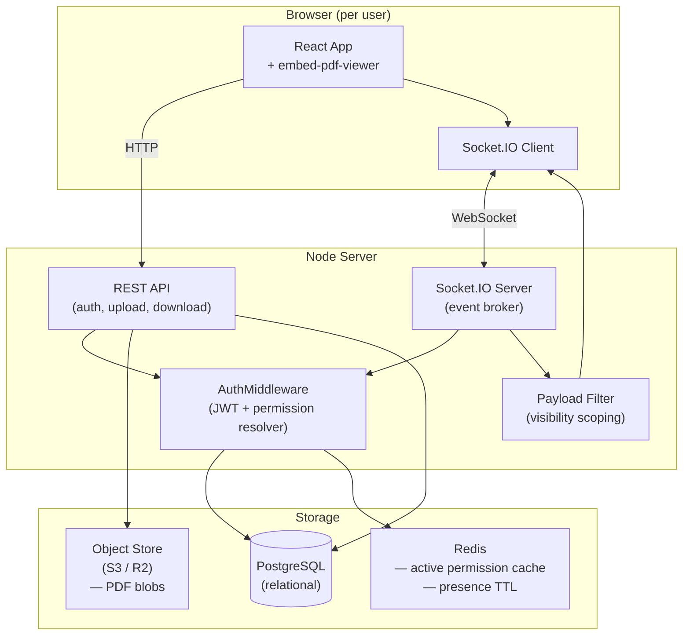
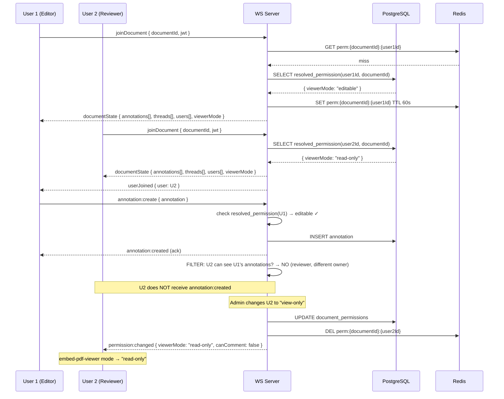

# Document Collaboration Platform — Architecture Design

> **Scope note:** Per-user granular permission overrides are designed as a **future-proof seam** — they are modelled in the schema and enforced through a single resolution function, but they are not expected to be exercised often. The cost of adding them later without this seam would be high; with it, activating them is a one-line change.

---

## (a) Architecture Summary

The platform is split into three runtime layers:

| Layer | Technology | Responsibility |
|---|---|---|
| **Frontend** | React + embed-pdf-viewer | Renders the PDF, drives viewer mode (`editable` / `read-only` / `hidden`) based on resolved permissions received from the server |
| **API + WS Server** | Node / Socket.IO | Validates every incoming event against the resolved-permission model before mutating state; broadcasts filtered payloads per recipient |
| **Database** | PostgreSQL (relational) | Single source of truth for users, roles, documents, annotations, comments, permissions, and download logs |

The flat-JSON persistence layer is replaced by PostgreSQL. The WebSocket server holds **no authoritative state** — it is a thin, stateless broker that reads permissions from DB on join and re-reads them on any permission-change event.

---

## (b) Diagrams

### System Architecture



### Concurrent-Editing Data Flow (N users, same document)



---

## (c) Data Model

All schemas are written as PostgreSQL DDL. UUIDs are used as primary keys throughout.

### Users & Auth

```sql
CREATE TABLE users (
    id          UUID PRIMARY KEY DEFAULT gen_random_uuid(),
    email       TEXT NOT NULL UNIQUE,
    name        TEXT NOT NULL,
    avatar_url  TEXT,
    created_at  TIMESTAMPTZ NOT NULL DEFAULT now(),
    is_active   BOOLEAN NOT NULL DEFAULT true
);

-- Platform-level role (one per user, determines journal/document visibility ceiling)
CREATE TYPE platform_role AS ENUM ('admin', 'editor', 'reviewer');

CREATE TABLE user_roles (
    user_id     UUID NOT NULL REFERENCES users(id) ON DELETE CASCADE,
    role        platform_role NOT NULL,
    PRIMARY KEY (user_id)
);
```

### Journals

```sql
CREATE TABLE journals (
    id          UUID PRIMARY KEY DEFAULT gen_random_uuid(),
    name        TEXT NOT NULL,
    created_by  UUID NOT NULL REFERENCES users(id),
    created_at  TIMESTAMPTZ NOT NULL DEFAULT now()
);

-- Which editors/admins are members of which journals
CREATE TABLE journal_members (
    journal_id  UUID NOT NULL REFERENCES journals(id) ON DELETE CASCADE,
    user_id     UUID NOT NULL REFERENCES users(id) ON DELETE CASCADE,
    PRIMARY KEY (journal_id, user_id)
);
```

### Documents

```sql
CREATE TABLE documents (
    id              UUID PRIMARY KEY DEFAULT gen_random_uuid(),
    journal_id      UUID NOT NULL REFERENCES journals(id) ON DELETE CASCADE,
    title           TEXT NOT NULL,
    storage_key     TEXT NOT NULL,        -- S3/R2 object key
    uploaded_by     UUID NOT NULL REFERENCES users(id),
    uploaded_at     TIMESTAMPTZ NOT NULL DEFAULT now(),
    -- Each document maps 1:1 to at most one active crowd-source group
    reviewer_group_id UUID REFERENCES reviewer_groups(id)
);
```

### Crowd-Source Reviewer Groups

```sql
CREATE TABLE reviewer_groups (
    id          UUID PRIMARY KEY DEFAULT gen_random_uuid(),
    name        TEXT NOT NULL,
    journal_id  UUID NOT NULL REFERENCES journals(id) ON DELETE CASCADE,
    created_by  UUID NOT NULL REFERENCES users(id),
    created_at  TIMESTAMPTZ NOT NULL DEFAULT now()
);

-- 1–200 reviewers per group
CREATE TABLE reviewer_group_members (
    group_id    UUID NOT NULL REFERENCES reviewer_groups(id) ON DELETE CASCADE,
    user_id     UUID NOT NULL REFERENCES users(id) ON DELETE CASCADE,
    PRIMARY KEY (group_id, user_id)
);
```

### Document Assignments (Reviewer → Document)

```sql
-- Reviewers are individually assigned from the document's reviewer_group
CREATE TABLE document_assignments (
    id              UUID PRIMARY KEY DEFAULT gen_random_uuid(),
    document_id     UUID NOT NULL REFERENCES documents(id) ON DELETE CASCADE,
    user_id         UUID NOT NULL REFERENCES users(id) ON DELETE CASCADE,
    assigned_by     UUID NOT NULL REFERENCES users(id),
    assigned_at     TIMESTAMPTZ NOT NULL DEFAULT now(),
    notified_at     TIMESTAMPTZ,          -- set when assignment notification is sent
    UNIQUE (document_id, user_id)
);
```

### Permissions

The permission model uses a **two-layer resolution**: a role-level default plus an optional per-user override. The override is a nullable column — `NULL` means "inherit from role default." This is the **future-proof seam**: activating per-user overrides requires only inserting/updating a single row.

```sql
CREATE TYPE viewer_mode AS ENUM ('editable', 'read-only', 'hidden');

-- 'all'     = this user sees annotations from every user on the document (default)
-- 'own_only' = this user sees only their own annotations
CREATE TYPE annotation_visibility AS ENUM ('all', 'own_only');

-- Per-user, per-document permission record
-- Created at assignment time with all nulls (inherit defaults)
-- An override is activated by setting the relevant column to a non-null value
CREATE TABLE document_permissions (
    document_id         UUID NOT NULL REFERENCES documents(id) ON DELETE CASCADE,
    user_id             UUID NOT NULL REFERENCES users(id) ON DELETE CASCADE,
    -- Overrides (NULL = use role default)
    --
    -- override_viewer_mode and override_can_annotate are intentionally separate:
    -- override_viewer_mode  → explicit lock (hidden / read-only for a whole class of users)
    -- override_can_annotate → fine-grained strip of annotation rights only
    -- The resolver derives a single effective_viewer_mode from both; never set
    -- override_viewer_mode='editable' AND override_can_annotate=false — the resolver
    -- would clamp the result to 'read-only' regardless.
    override_viewer_mode            viewer_mode,
    override_can_comment            BOOLEAN,
    override_can_annotate           BOOLEAN,
    -- Controls what annotations this user can SEE (not just create)
    -- NULL → 'all'; set to 'own_only' to restrict a specific user without touching others
    override_annotation_visibility  annotation_visibility,
    -- Download overrides
    override_download_annotations   BOOLEAN,
    override_download_comments      BOOLEAN,
    override_download_full_pdf      BOOLEAN,
    updated_at          TIMESTAMPTZ NOT NULL DEFAULT now(),
    updated_by          UUID REFERENCES users(id),
    PRIMARY KEY (document_id, user_id)
);
```

**Role defaults** (applied when override columns are NULL):

| Role | viewer_mode | can_annotate | can_comment | annotation_visibility | download_annotations | download_comments | download_full_pdf |
|---|---|---|---|---|---|---|---|
| `admin` | `editable` | ✓ | ✓ | `all` | ✓ | ✓ | ✓ |
| `editor` | `editable` | ✓ | ✓ | `all` | ✓ | ✓ | ✓ |
| `reviewer` | `editable` | ✓ | ✓ | `all` | ✓ | ✓ | ✓ |

> Reviewer defaults are set permissively; revocation is done via the override columns. This keeps the common path (full access) fast and makes restriction an explicit, auditable action.

**Permission resolver (single SQL function — the enforcement choke point):**

```sql
CREATE OR REPLACE FUNCTION resolved_permission(
    p_user_id    UUID,
    p_document_id UUID
) RETURNS TABLE (
    -- Single derived mode sent to the client — no ambiguity
    effective_viewer_mode   viewer_mode,
    can_comment             BOOLEAN,
    annotation_visibility   annotation_visibility,
    download_annotations    BOOLEAN,
    download_comments       BOOLEAN,
    download_full_pdf       BOOLEAN
) LANGUAGE plpgsql AS $$
DECLARE
    v_role          platform_role;
    v_perm          document_permissions%ROWTYPE;
    v_raw_mode      viewer_mode;
    v_can_annotate  BOOLEAN;
BEGIN
    -- 1. Get platform role
    SELECT role INTO v_role FROM user_roles WHERE user_id = p_user_id;

    -- 2. Get override row (may not exist)
    SELECT * INTO v_perm
    FROM document_permissions
    WHERE document_id = p_document_id AND user_id = p_user_id;

    -- 3. Resolve raw viewer_mode (from explicit override or role default)
    v_raw_mode := COALESCE(v_perm.override_viewer_mode,
        CASE v_role
            WHEN 'admin'    THEN 'editable'::viewer_mode
            WHEN 'editor'   THEN 'editable'::viewer_mode
            WHEN 'reviewer' THEN 'editable'::viewer_mode
        END);

    -- 4. Resolve can_annotate flag
    v_can_annotate := COALESCE(v_perm.override_can_annotate, true);

    -- 5. Derive effective_viewer_mode — the two fields must agree:
    --    If can_annotate=false overrides an 'editable' mode, clamp down to 'read-only'.
    --    'hidden' always wins regardless of can_annotate.
    --    This is the single value sent to the client; there is no ambiguous state.
    RETURN QUERY SELECT
        CASE
            WHEN v_raw_mode = 'hidden'   THEN 'hidden'::viewer_mode
            WHEN v_can_annotate = false  THEN 'read-only'::viewer_mode
            ELSE v_raw_mode
        END,
        COALESCE(v_perm.override_can_comment, true),
        -- Default 'all': every user sees every other user's annotations
        COALESCE(v_perm.override_annotation_visibility, 'all'::annotation_visibility),
        COALESCE(v_perm.override_download_annotations, true),
        COALESCE(v_perm.override_download_comments,    true),
        COALESCE(v_perm.override_download_full_pdf,    true);
END;
$$;
```

### Annotations

```sql
CREATE TABLE annotations (
    id              UUID PRIMARY KEY DEFAULT gen_random_uuid(),
    document_id     UUID NOT NULL REFERENCES documents(id) ON DELETE CASCADE,
    author_id       UUID NOT NULL REFERENCES users(id),
    page_index      INTEGER NOT NULL,
    type            TEXT NOT NULL,        -- highlight, rect, ink, lineArrow, etc.
    rect            JSONB NOT NULL,
    segment_rects   JSONB,
    color           TEXT,
    opacity         NUMERIC(3,2),
    contents        TEXT,
    subject         TEXT,
    custom_data     JSONB,               -- tool-specific fields (embed-pdf-viewer passthrough)
    created_at      TIMESTAMPTZ NOT NULL DEFAULT now(),
    updated_at      TIMESTAMPTZ NOT NULL DEFAULT now(),
    deleted_at      TIMESTAMPTZ          -- soft delete; NULL = active
);

CREATE INDEX ON annotations(document_id, page_index) WHERE deleted_at IS NULL;
CREATE INDEX ON annotations(document_id, author_id)  WHERE deleted_at IS NULL;
```

### Comments (Threads + Messages)

```sql
CREATE TABLE comment_threads (
    id              UUID PRIMARY KEY DEFAULT gen_random_uuid(),
    document_id     UUID NOT NULL REFERENCES documents(id) ON DELETE CASCADE,
    annotation_id   UUID REFERENCES annotations(id) ON DELETE SET NULL,
    author_id       UUID NOT NULL REFERENCES users(id),
    page_index      INTEGER NOT NULL,
    anchor_ratio    NUMERIC(5,4),
    quote           TEXT,
    created_at      TIMESTAMPTZ NOT NULL DEFAULT now(),
    deleted_at      TIMESTAMPTZ
);

CREATE TABLE comment_messages (
    id              UUID PRIMARY KEY DEFAULT gen_random_uuid(),
    thread_id       UUID NOT NULL REFERENCES comment_threads(id) ON DELETE CASCADE,
    parent_id       UUID REFERENCES comment_messages(id),   -- for replies
    author_id       UUID NOT NULL REFERENCES users(id),
    body            TEXT NOT NULL,
    created_at      TIMESTAMPTZ NOT NULL DEFAULT now(),
    edited_at       TIMESTAMPTZ,
    deleted_at      TIMESTAMPTZ
);

-- Tagged (private) threads: only tagger + tagged + (optionally) admin can see
-- A thread with zero rows here is public (visible per normal rules)
CREATE TABLE comment_thread_tags (
    thread_id       UUID NOT NULL REFERENCES comment_threads(id) ON DELETE CASCADE,
    tagged_user_id  UUID NOT NULL REFERENCES users(id) ON DELETE CASCADE,
    tagged_by       UUID NOT NULL REFERENCES users(id),
    tagged_at       TIMESTAMPTZ NOT NULL DEFAULT now(),
    PRIMARY KEY (thread_id, tagged_user_id)
);
```

### Download Log (audit trail for enforcement)

```sql
CREATE TABLE download_log (
    id              UUID PRIMARY KEY DEFAULT gen_random_uuid(),
    document_id     UUID NOT NULL REFERENCES documents(id),
    user_id         UUID NOT NULL REFERENCES users(id),
    download_type   TEXT NOT NULL CHECK (download_type IN ('annotations', 'comments', 'full')),
    requested_at    TIMESTAMPTZ NOT NULL DEFAULT now(),
    status          TEXT NOT NULL CHECK (status IN ('allowed', 'denied')),
    deny_reason     TEXT
);
```

---

## (d) WebSocket Event Contract

Direction key: **C→S** = client sends, **S→C** = server sends.

### Connection & Session

| Event | Dir | Request Payload | Response / Broadcast |
|---|---|---|---|
| `join:document` | C→S | `{ documentId, jwt }` | S→C to sender: `session:ready` |
| `session:ready` | S→C | — | `{ viewerMode, canAnnotate, canComment, annotations[], threads[], users[] }` — filtered per resolved permission |
| `leave:document` | C→S | `{ documentId }` | S→C to room: `presence:left { userId }` |

### Annotations

| Event | Dir | Request Payload | Response / Broadcast |
|---|---|---|---|
| `annotation:create` | C→S | `{ documentId, annotation: AnnotationPayload }` | S→C to **eligible recipients**: `annotation:created { annotation, authorId }` |
| `annotation:update` | C→S | `{ documentId, annotationId, delta: Partial<AnnotationPayload> }` | S→C to **eligible recipients**: `annotation:updated { annotationId, delta, authorId }` |
| `annotation:delete` | C→S | `{ documentId, annotationId }` | S→C to **eligible recipients**: `annotation:deleted { annotationId, authorId }` |
| `annotation:created` | S→C | — | `{ annotation, authorId }` |
| `annotation:updated` | S→C | — | `{ annotationId, delta, authorId }` |
| `annotation:deleted` | S→C | — | `{ annotationId, authorId }` |

> **Visibility rule for annotation broadcasts:** By default all users in the document room (Admins, Editors, and Reviewers) receive annotation events from every other user — `annotation_visibility = 'all'`. The server checks the **recipient's** resolved `annotation_visibility` before forwarding each event: if it is `'own_only'`, the event is dropped unless `annotation.authorId === recipientId`. To restrict a specific user, set `override_annotation_visibility = 'own_only'` on their `document_permissions` row — no other users are affected.

### Comments

| Event | Dir | Request Payload | Response / Broadcast |
|---|---|---|---|
| `comment:create_thread` | C→S | `{ documentId, annotationId?, pageIndex, quote?, body }` | S→C to **visible recipients**: `comment:thread_created` |
| `comment:reply` | C→S | `{ documentId, threadId, parentId?, body }` | S→C to **visible recipients**: `comment:reply_added` |
| `comment:tag` | C→S | `{ documentId, threadId, taggedUserId }` | S→C to tagger + tagged: `comment:tag_applied { threadId, taggedUserId }` — thread becomes private |
| `comment:thread_created` | S→C | — | `{ thread: ThreadPayload, authorId }` — only sent to users who can see this thread |
| `comment:reply_added` | S→C | — | `{ threadId, message: MessagePayload, authorId }` |
| `comment:tag_applied` | S→C | — | `{ threadId, taggedUserId }` |

### Permission Changes (live enforcement)

| Event | Dir | Request Payload | Response / Broadcast |
|---|---|---|---|
| `permission:update` | C→S | `{ documentId, targetUserId, overrides: PermissionOverrides }` | Server: persist to DB, invalidate Redis cache, then S→C below |
| `permission:changed` | S→C | — | `{ targetUserId, viewerMode, canAnnotate, canComment }` — sent only to the affected user's socket(s) |

**Mid-session revocation flow:**
1. Admin/Editor sends `permission:update` (e.g., `override_can_annotate: false`).
2. Server writes to `document_permissions`, deletes Redis key `perm:{documentId}:{targetUserId}`.
3. Server emits `permission:changed` to the target user's socket.
4. Client receives event → calls `viewer.setViewMode('read-only')` on the embed-pdf-viewer instance.
5. Any in-flight `annotation:create` events from that user that arrive after the DB write are rejected at the server with an `error:permission_denied` event — the server always re-checks resolved_permission before mutating.

### Presence & Typing

| Event | Dir | Payload | Notes |
|---|---|---|---|
| `presence:cursor` | C→S | `{ documentId, pageIndex, x, y }` | Throttled to 50ms on client |
| `presence:cursor_moved` | S→C | `{ userId, pageIndex, x, y }` | Broadcast to room, excluding sender |
| `presence:typing` | C→S | `{ documentId, threadId }` | |
| `presence:typing_indicator` | S→C | `{ userId, threadId }` | Auto-cleared server-side after 3s |
| `presence:joined` | S→C | `{ user: UserPayload }` | Broadcast to room on join |
| `presence:left` | S→C | `{ userId }` | Broadcast to room on leave/disconnect |

### AnnotationPayload & PermissionOverrides (TypeScript shapes)

```typescript
interface AnnotationPayload {
  id: string;
  pageIndex: number;
  type: string;
  rect: { origin: { x: number; y: number }; size: { width: number; height: number } };
  segmentRects?: unknown[];
  color?: string;
  opacity?: number;        // 0..1
  contents?: string;
  subject?: string;
  customData?: Record<string, unknown>;
}

interface ThreadPayload {
  id: string;
  documentId: string;
  annotationId: string | null;
  pageIndex: number;
  quote?: string;
  anchorRatio?: number;
  messages: MessagePayload[];
  isPrivate: boolean;      // true when comment_thread_tags has rows for this thread
  taggedUserIds: string[]; // populated only for tagger, tagged user, and admin
}

interface MessagePayload {
  id: string;
  threadId: string;
  parentId: string | null;
  authorId: string;
  authorName: string;
  body: string;
  createdAt: number;
}

// Only non-null fields are sent; null means "clear override, revert to role default"
interface PermissionOverrides {
  viewerMode?: 'editable' | 'read-only' | 'hidden' | null;
  canAnnotate?: boolean | null;
  canComment?: boolean | null;
  // 'all' = see everyone's annotations; 'own_only' = see only own
  annotationVisibility?: 'all' | 'own_only' | null;
  downloadAnnotations?: boolean | null;
  downloadComments?: boolean | null;
  downloadFullPdf?: boolean | null;
}
```

---

## Role & Permission Enforcement Model

### Layers (defense in depth)

```
Request path:  Client → [1] JWT middleware → [2] Role gate → [3] resolved_permission() → [4] Handler
WS event path: Client → [1] Socket auth → [2] resolved_permission() → [3] Handler → [4] Payload filter
```

1. **JWT middleware** — every REST request and every WebSocket connection must carry a valid JWT. The JWT carries `userId` and `platformRole` only — no permission data (permissions are re-read from DB/Redis).
2. **Role gate (REST)** — coarse access: e.g., only `admin`/`editor` can call `POST /api/documents` or `PATCH /api/permissions/:id`.
3. **`resolved_permission()` (DB function)** — the single authoritative check for any mutation. Called on every WS event that touches annotations, comments, or downloads.
4. **Payload filter** — before broadcasting any S→C event, the server applies visibility rules (see Comment Visibility below) to determine the recipient list.

### embed-pdf-viewer mode mapping

| Resolved `viewerMode` | embed-pdf-viewer mode set on client |
|---|---|
| `editable` | `editable` — user can create/edit/delete their own annotations |
| `read-only` | `read-only` / `locked` — viewer shows existing annotations, no creation UI |
| `hidden` | `hidden` / `no-view` — no annotation layer rendered at all |

The mode is set once on `session:ready` and updated in-place on `permission:changed`. The embed-pdf-viewer `setViewMode` API call is made by the client upon receiving either event — the server never trusts the client's self-reported mode.

---

## Comment Visibility / Tagging Logic

A comment thread is **public** (within the document) unless it has rows in `comment_thread_tags`.

**Visibility decision (evaluated server-side before every broadcast):**

```
can_see_thread(userId, thread) =
  IF thread has NO rows in comment_thread_tags:
    → Admin/Editor of this document's journal: YES
    → Reviewer: YES only if (userId === thread.author_id)
                            OR (userId is tagged in any message of this thread)
  IF thread HAS rows in comment_thread_tags:
    → thread.author_id:              YES  (the tagger who created the thread)
    → tagged_user_ids[]:             YES  (each tagged user)
    → Admin/Editor (assumption A1):  YES  (see Assumptions)
    → Everyone else:                 NO
```

**Tag semantics:**
- Tagging is applied at the thread level, not message level. Once a thread is tagged, the entire thread (all past and future messages) becomes private.
- Multiple users can be tagged in the same thread (one row per tagged user).
- Untagging a user removes their row; they immediately lose visibility on the next server re-check.
- A tagged user receives `comment:thread_created` (or `comment:reply_added`) only if they are in the visible set — the server re-evaluates on each message.

---

## Download Pipeline

Every download request is a REST call; never a WebSocket event (WS is not suitable for blob transfers).

```
GET /api/documents/:documentId/download?type=full|annotations|comments
    Authorization: Bearer <jwt>
```

**Server-side enforcement:**

```
1. Verify JWT → userId
2. CALL resolved_permission(userId, documentId) → { downloadAnnotations, downloadComments, downloadFullPdf }
3. Check requested type against resolved flags:
   - type=full         → require downloadFullPdf = true
   - type=annotations  → require downloadAnnotations = true
   - type=comments     → require downloadComments = true
4. If denied → 403, INSERT download_log(status='denied')
5. If allowed:
   a. Fetch base PDF blob from S3 (for full / annotations)
   b. Fetch annotations from DB WHERE document_id = X AND deleted_at IS NULL
      - For full/annotations: include ALL annotations (admin/editor)
      - For reviewer: include only their own annotations
   c. Fetch comment threads per visibility rules above
   d. Merge/render server-side (or return structured JSON for client-side merge)
   e. INSERT download_log(status='allowed', download_type=type)
   f. Stream response
```

> The `download_type` check is enforced at the API handler level — it is not a UI toggle. A user who bypasses the UI and sends a raw HTTP request still hits the same `resolved_permission` gate.

---

## (e) Assumptions & Open Questions

### Assumptions made (confirm before implementation)

| ID | Assumption |
|---|---|
| **A1** | Admins and Editors with journal membership can see all private/tagged comment threads on documents within that journal. This gives them moderation capability. If privacy from admins is required, the visibility rule for tagged threads changes to: *only tagger + tagged users, full stop*. |
| **A2** | A Reviewer can belong to multiple crowd-source groups across *different* documents, but any single document maps to at most one group. (The constraint is document → group, not user → group.) |
| **A3** | If a user's access is revoked (`hidden`) after they have created annotations, those annotations are retained in the database (soft-delete the assignment, not the annotations). A re-grant restores visibility. Permanent deletion is a separate, explicit admin action. |
| **A4** | The Editor role includes journal-level editor users who may also act as reviewers on specific documents. Their effective permission on a given document is determined by `resolved_permission`, which handles both cases via the same function. |
| **A5** | Notifications (assignment, tagging) are out-of-band (email / push) and not delivered over WebSocket. The WS layer handles only real-time in-session events. |
| **A6** | The Redis cache TTL for resolved permissions is 60 seconds. A permission change event from the server immediately invalidates the cache entry, so the TTL is only a safety net for cache-miss scenarios. |

### Open questions (require product/business confirmation)

| ID | Question | Impact |
|---|---|---|
| ~~**Q1**~~ | ✅ **Resolved.** All users (including Reviewers) see each other's annotations by default (`annotation_visibility = 'all'`). Restricting a specific user to their own annotations is a single-column override (`override_annotation_visibility = 'own_only'`) and does not affect any other user. |
| **Q2** | When an Editor invites an outside user as a Reviewer, does that user get a platform account, or is there a guest/token-based access flow? Guest access changes the auth model. |
| **Q3** | What is the retention policy for annotations and comments if the document is deleted? Cascade delete or archive? |
| **Q4** | Can Admin override a per-user permission that was set by an Editor, or is it scoped to whoever set it? |
| **Q5** | Is there a concept of "document versioning" — i.e., if the underlying PDF is replaced, do existing annotations remain attached to the old version? |
| **Q6** | Should the download log be exposed as an audit report in the UI (e.g., Admin can see who downloaded what and when)? |
| **Q7** | Are there any GDPR / data-residency requirements that affect where annotations and comments are stored (e.g., must remain in a specific region)? |
