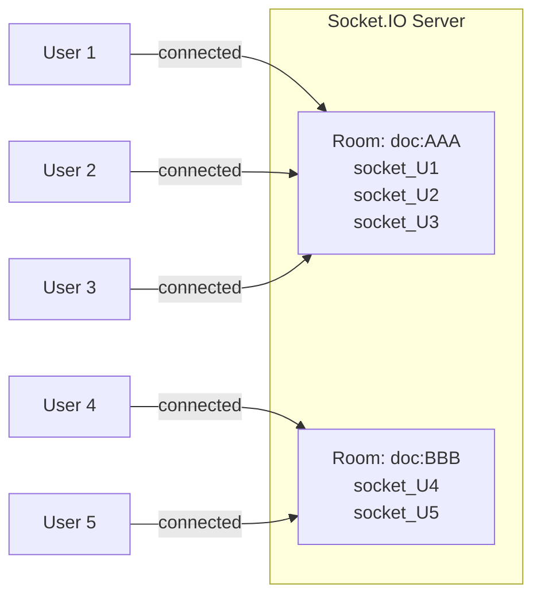
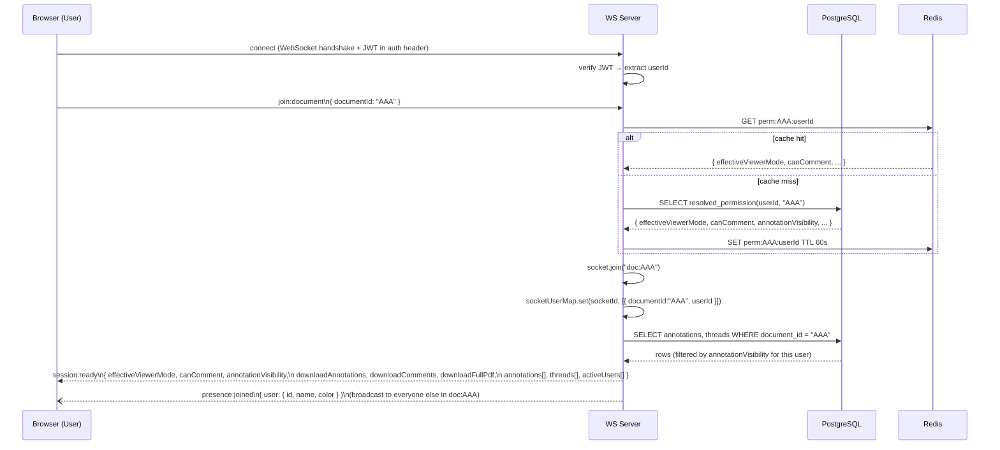
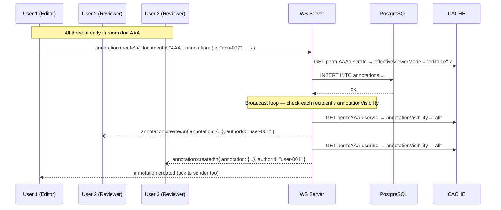
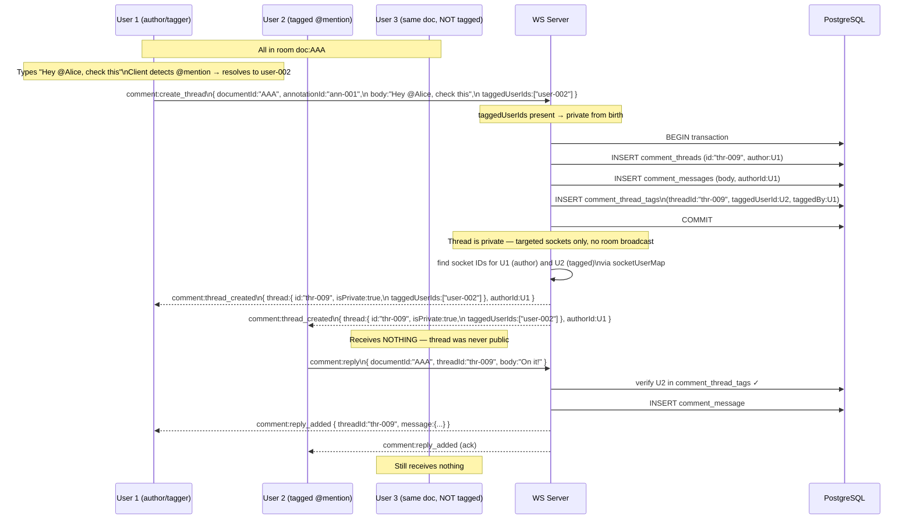
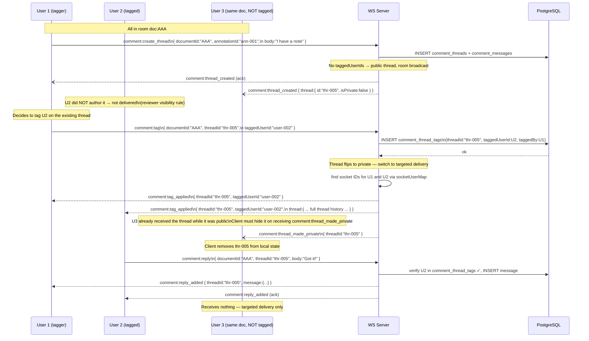
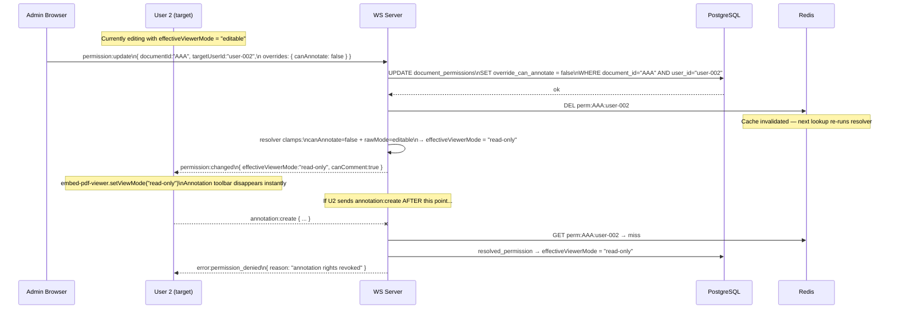
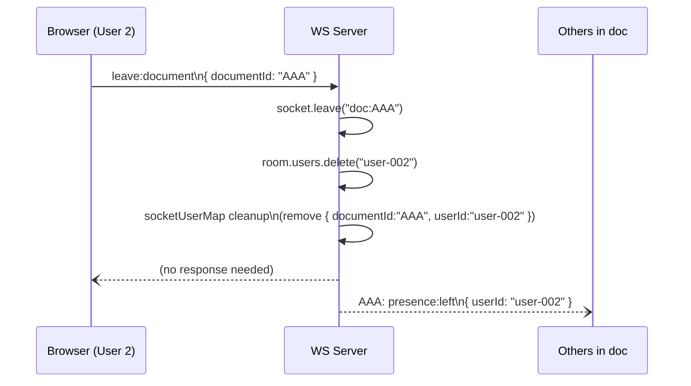
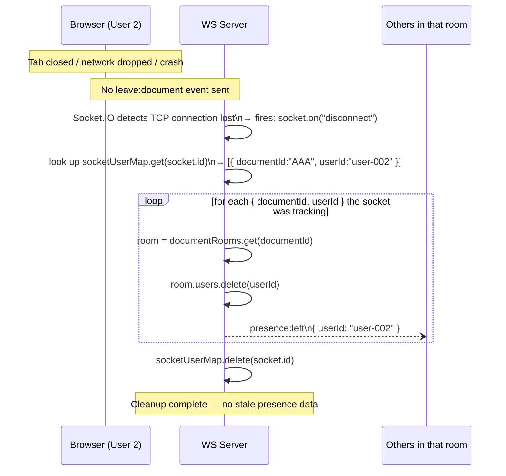
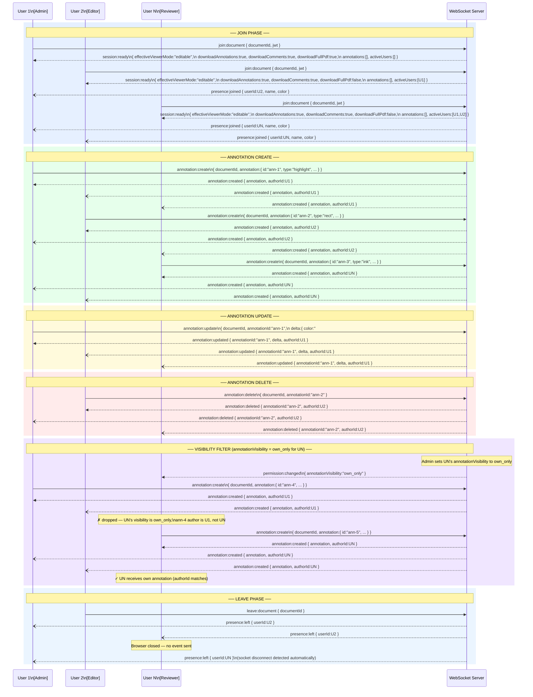

# WebSocket Layer — Complete Flow Design

This document explains the real-time socket layer end-to-end: how rooms work, how N users collaborate on the same document, how tagged (private) comments are delivered only to specific users, and how disconnects are handled cleanly.

---

## 1. Core Concept — Rooms

Every document gets its own Socket.IO **room** on the server. A room is just a named group of sockets. Broadcasting to the room delivers the message to every socket in it — and nobody else.



> A broadcast to `doc:AAA` reaches U1, U2, U3. U4 and U5 never see it.

---

## 2. Join Flow — Landing on the Document Page



**Sample `session:ready` payload:**
```json
{
  "effectiveViewerMode": "editable",
  "canComment": true,
  "annotationVisibility": "all",
  "downloadAnnotations": true,
  "downloadComments": true,
  "downloadFullPdf": false,
  "annotations": [
    {
      "id": "ann-001",
      "pageIndex": 2,
      "type": "highlight",
      "rect": { "origin": { "x": 120, "y": 340 }, "size": { "width": 200, "height": 18 } },
      "color": "#FFD700",
      "opacity": 0.7,
      "authorId": "user-002",
      "authorName": "Alice"
    }
  ],
  "threads": [],
  "activeUsers": [
    { "id": "user-002", "name": "Alice", "color": "#3B82F6" }
  ]
}
```

---

## 3. N Users on the Same Document — Annotation Broadcast



**Sample `annotation:create` payload (client → server):**
```json
{
  "documentId": "AAA",
  "annotation": {
    "id": "ann-007",
    "pageIndex": 1,
    "type": "highlight",
    "rect": { "origin": { "x": 50, "y": 200 }, "size": { "width": 300, "height": 20 } },
    "color": "#FF6B6B",
    "opacity": 0.6,
    "contents": "Important section"
  }
}
```

**Sample `annotation:created` payload (server → clients):**
```json
{
  "annotation": {
    "id": "ann-007",
    "pageIndex": 1,
    "type": "highlight",
    "rect": { "origin": { "x": 50, "y": 200 }, "size": { "width": 300, "height": 20 } },
    "color": "#FF6B6B",
    "opacity": 0.6,
    "authorId": "user-001",
    "authorName": "Bob"
  },
  "authorId": "user-001"
}
```

---

## 4. Tagged (Private) Comment — Targeted Delivery

This is where room-level broadcast is **not used**. A tagged thread must only reach the tagger and the tagged user — not the whole room.

There are two ways a thread becomes tagged: **inline at creation** (user types `@mention` in the first message) or **after creation** (user tags someone on an existing thread). Both are shown below.

### 4a. Inline Tag — Thread Born Private (recommended path)



### 4b. Post-Creation Tag — Thread Transitions from Public to Private



**How the server finds the right socket for a specific user:**

The server maintains `socketUserMap`:
```
socket_id_X  →  [{ documentId: "AAA", userId: "user-001" }]
socket_id_Y  →  [{ documentId: "AAA", userId: "user-002" }]
socket_id_Z  →  [{ documentId: "AAA", userId: "user-003" }]
```

To send only to `user-002`:
```
// server-side pseudo-code
const targetSocketIds = [...socketUserMap.entries()]
  .filter(([_, docs]) => docs.some(d => d.userId === "user-002" && d.documentId === "AAA"))
  .map(([socketId]) => socketId);

targetSocketIds.forEach(id => io.to(id).emit("comment:reply_added", payload));
```

**Sample payloads:**

`comment:create_thread` with inline tag (client → server):
```json
{
  "documentId": "AAA",
  "annotationId": "ann-001",
  "pageIndex": 2,
  "body": "Hey @Alice, can you check this?",
  "taggedUserIds": ["user-002"]
}
```

`comment:tag` post-creation (client → server):
```json
{
  "documentId": "AAA",
  "threadId": "thr-005",
  "taggedUserId": "user-002"
}
```

`comment:thread_made_private` (server → users who saw it while public):
```json
{
  "threadId": "thr-005"
}
```

---

## 5. Permission Change Mid-Session



---

## 6. Leave Flow — Two Scenarios

### 6a. Graceful Leave (user navigates away, component unmounts)



### 6b. Abrupt Disconnect (browser tab closed, network lost, crash)

The client never gets a chance to send `leave:document`. Socket.IO fires a `disconnect` event on the server side automatically — this is the key safety net.



> A user with **multiple tabs open** on the same document has multiple socket entries in `socketUserMap`. The disconnect handler only removes the entry for the closed tab's socket. Presence is only cleared when the last socket for that user leaves the room.

---

## 7. Full N-User Concurrent Flow (All Together)

```mermaid
sequenceDiagram
    participant U1 as User 1\n(Editor)
    participant U2 as User 2\n(Reviewer)
    participant U3 as User 3\n(Reviewer, tagged)
    participant SRV as WS Server
    participant DB as PostgreSQL

    Note over U1,U3: === JOIN PHASE ===

    U1->>SRV: join:document { documentId:"AAA" }
    SRV-->>U1: session:ready { viewerMode:"editable",
              downloadAnnotations:true, downloadComments:true, downloadFullPdf:true,
              annotations:[], users:[] }

    U2->>SRV: join:document { documentId:"AAA" }
    SRV-->>U2: session:ready { viewerMode:"editable",
              downloadAnnotations:true, downloadComments:true, downloadFullPdf:false,
              annotations:[], users:[U1] }
    SRV--)U1: presence:joined { user: U2 }

    U3->>SRV: join:document { documentId:"AAA" }
    SRV-->>U3: session:ready { viewerMode:"editable",
              downloadAnnotations:true, downloadComments:true, downloadFullPdf:false,
              annotations:[], users:[U1,U2] }
    SRV--)U1: presence:joined { user: U3 }
    SRV--)U2: presence:joined { user: U3 }

    Note over U1,U3: === ACTIVITY PHASE ===

    U1->>SRV: annotation:create { ann-001 }
    SRV->>DB: INSERT annotation
    SRV--)U1: annotation:created (ack)
    SRV--)U2: annotation:created { ann-001, authorId:U1 }
    SRV--)U3: annotation:created { ann-001, authorId:U1 }

    U2->>SRV: comment:create_thread\n{ annotationId:"ann-001", body:"I have a note" }
    SRV->>DB: INSERT thread + message
    SRV--)U1: comment:thread_created (visible: editor sees all)
    SRV--)U2: comment:thread_created (ack)
    Note over U3: NOT sent — U3 didn't author it, not tagged yet

    U2->>SRV: comment:tag\n{ threadId:"thr-X", taggedUserId: U3 }
    SRV->>DB: INSERT comment_thread_tags
    SRV-->>U2: comment:tag_applied (targeted)
    SRV-->>U3: comment:tag_applied (targeted — U3 can now see the thread)
    Note over U1: U1 (editor) already sees it per A1

    U3->>SRV: comment:reply\n{ threadId:"thr-X", body:"Agreed" }
    SRV->>DB: verify U3 in thread_tags ✓, INSERT message
    SRV-->>U2: comment:reply_added (targeted)
    SRV-->>U3: comment:reply_added (ack, targeted)
    SRV-->>U1: comment:reply_added (editor override visibility)
    Note over SRV: No room broadcast — targeted delivery only for private threads

    Note over U1,U3: === LEAVE PHASE ===

    U2->>SRV: leave:document { documentId:"AAA" }
    SRV--)U1: presence:left { userId: U2 }
    SRV--)U3: presence:left { userId: U2 }

    Note over U3: Browser tab crash — no leave event sent
    SRV->>SRV: disconnect event fires for U3's socket
    SRV--)U1: presence:left { userId: U3 }
```

---

## 8. Single Diagram — Full Annotation Lifecycle (N Users)

> Three users, three roles, one document. Every annotation event from join to disconnect in one place.



---

## 9. Summary — Delivery Method per Event Type

| Event | Delivery method | Who receives |
|---|---|---|
| `annotation:created/updated/deleted` | `io.to("doc:AAA")` then per-recipient visibility filter | All users whose `annotationVisibility = 'all'`; own-only users receive only their own |
| `comment:thread_created` (public thread) | `io.to("doc:AAA")` | Author + Admin/Editor; other reviewers excluded |
| `comment:thread_created` (tagged thread) | `io.to(socketId)` per user | Tagger + each tagged user + Admin/Editor only |
| `comment:reply_added` (public) | Same as thread_created | Same rules as the thread |
| `comment:reply_added` (private/tagged) | `io.to(socketId)` per user | Same as tagged thread |
| `comment:tag_applied` | `io.to(socketId)` × 2 | Tagger + tagged user only |
| `permission:changed` | `io.to(socketId)` | The affected user only |
| `presence:joined/left` | `io.to("doc:AAA")` | Everyone in the room |
| `presence:cursor_moved` | `socket.to("doc:AAA")` (excludes sender) | Everyone except the mover |
